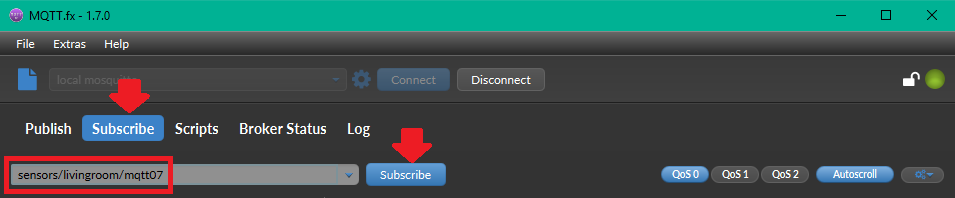
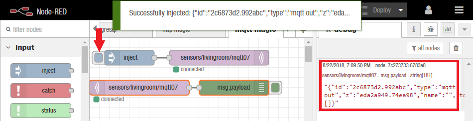
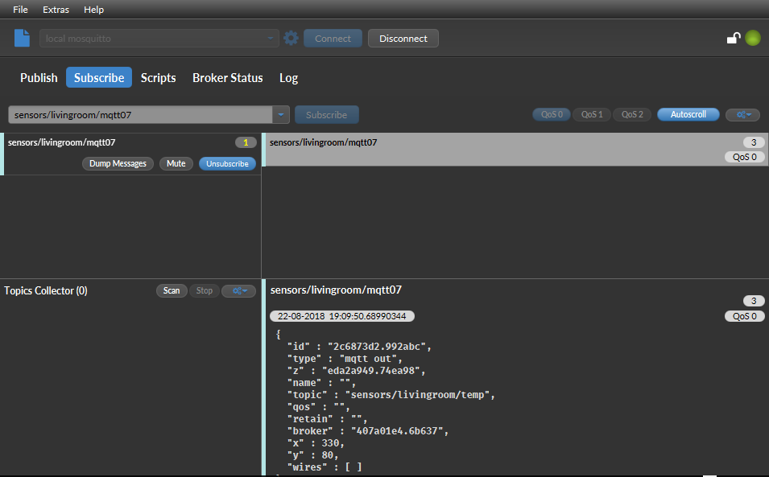
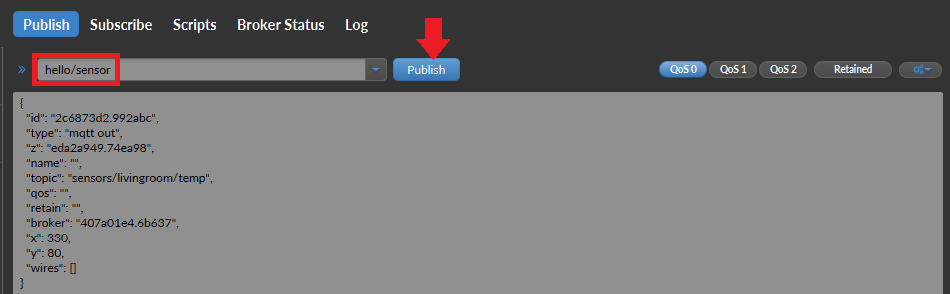
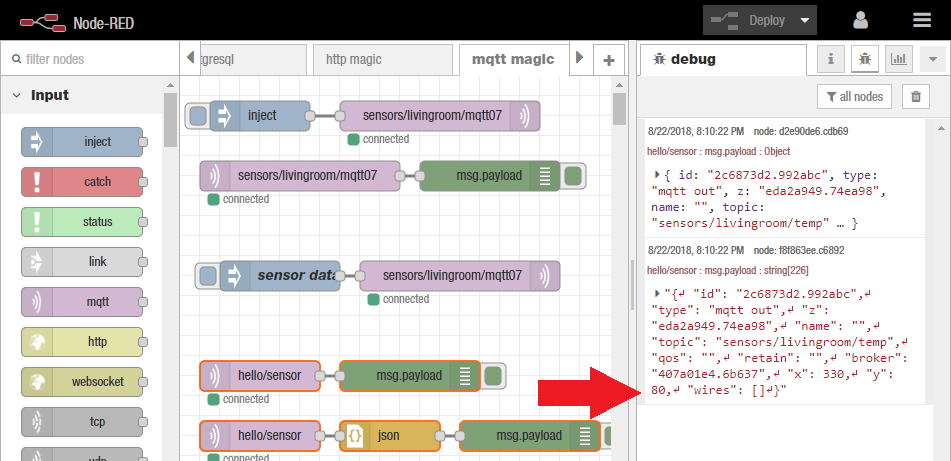

# A Collection of Node-RED MQTT Recipes

We are going to use a [MQTT](https://thenewstack.io/mqtt-protocol-iot/) Broker to test our Node-RED flows under Windows - the MQTT.fx Software can be [downloaded here](https://mqttfx.jensd.de/index.php/download).


## Connect to an MQTT Broker

The Node-RED flow that we are going to write in a moment, is going to broadcast `@sensors/livingroom/mqtt07` - so the first step is to subscribe our broker to it:




Import the following flow to Node-RED - It uses the __MQTT Input__ input and __MQTT Output__ node and an associated __MQTT Config__ node to connect to an MQTT broker.

```json
[{"id":"1be4a3d2.9a1e7c","type":"mqtt in","z":"9bdc093c.fd4b08","name":"","topic":"sensors/livingroom/mqtt07","qos":"2","broker":"47feb3e4.56f11c","x":100,"y":100,"wires":[["7c273733.6783e8"]]},{"id":"7c273733.6783e8","type":"debug","z":"9bdc093c.fd4b08","name":"","active":true,"tosidebar":true,"console":false,"complete":"false","x":290,"y":100,"wires":[]},{"id":"47feb3e4.56f11c","type":"mqtt-broker","z":"","broker":"localhost","port":"1883","clientid":"","usetls":false,"compatmode":true,"keepalive":"60","cleansession":true,"birthTopic":"","birthQos":"0","birthPayload":"","willTopic":"","willQos":"0","willPayload":""}]
```





Triggering the flow will send a JSON Message via the MQTT protocol, that will now be caught by MQTT.fx





We can now use the __MQTT Output__ node to publish messages to a topic:


```json
[{"id":"9c138886.116928","type":"mqtt out","z":"eda2a949.74ea98","name":"","topic":"sensors/kitchen/mqtt07","qos":"","retain":"","broker":"61de5090.0f5d9","x":430,"y":100,"wires":[]},{"id":"ff654e7f.32e9e","type":"inject","z":"eda2a949.74ea98","name":"temperature","topic":"","payload":"22","payloadType":"num","repeat":"","crontab":"","once":false,"x":230,"y":100,"wires":[["9c138886.116928"]]},{"id":"61de5090.0f5d9","type":"mqtt-broker","z":"","broker":"localhost","port":"1883","clientid":"","usetls":false,"compatmode":true,"keepalive":"60","cleansession":true,"willTopic":"","willQos":"0","willPayload":"","birthTopic":"","birthQos":"0","birthPayload":""}]
```


You can use the __MQTT Input__ node and a __JSON node__ to receive a parsed JSON message:


```json
[{"id":"8024cb4.98c5238","type":"mqtt in","z":"eda2a949.74ea98","name":"","topic":"sensors/#","qos":"2","broker":"61de5090.0f5d9","x":260,"y":580,"wires":[["b5098b7f.2361d8"]]},{"id":"15d727dd.33e808","type":"debug","z":"eda2a949.74ea98","name":"","active":true,"console":"false","complete":"false","x":530,"y":580,"wires":[]},{"id":"2aed678c.3de738","type":"mqtt out","z":"eda2a949.74ea98","name":"","topic":"sensors/livingroom/temp","qos":"","retain":"false","broker":"61de5090.0f5d9","x":310,"y":520,"wires":[]},{"id":"3b613a69.a247c6","type":"inject","z":"eda2a949.74ea98","name":"temp json","topic":"","payload":"{\"sensor_id\":1234,\"temperature\":13}","payloadType":"json","repeat":"","crontab":"","once":false,"x":120,"y":520,"wires":[["2aed678c.3de738"]]},{"id":"b5098b7f.2361d8","type":"json","z":"eda2a949.74ea98","name":"","pretty":false,"x":390,"y":580,"wires":[["15d727dd.33e808"]]},{"id":"61de5090.0f5d9","type":"mqtt-broker","z":"","broker":"localhost","port":"1883","clientid":"","usetls":false,"compatmode":true,"keepalive":"60","cleansession":true,"willTopic":"","willQos":"0","willPayload":"","birthTopic":"","birthQos":"0","birthPayload":""}]
```


Use the __MQTT Input__ node to subscribe to messages sent to a topic or a topic pattern:

```json
[{"id":"31edb119.efc91e","type":"mqtt in","z":"9bdc093c.fd4b08","name":"","topic":"hello/sensor","qos":"2","broker":"520ad9a0.e248f8","x":80,"y":360,"wires":[["ebdeaa8d.d92938"]]},{"id":"d2e90de6.cdb69","type":"debug","z":"9bdc093c.fd4b08","name":"","active":true,"tosidebar":true,"console":false,"complete":"false","x":350,"y":360,"wires":[]},{"id":"ebdeaa8d.d92938","type":"json","z":"9bdc093c.fd4b08","name":"","pretty":false,"x":210,"y":360,"wires":[["d2e90de6.cdb69"]]},{"id":"a3d8c237.39c09","type":"mqtt in","z":"9bdc093c.fd4b08","name":"","topic":"hello/sensor","qos":"2","broker":"7564ccbd.a16c44","x":80,"y":300,"wires":[["f8f863ee.c6892"]]},{"id":"f8f863ee.c6892","type":"debug","z":"9bdc093c.fd4b08","name":"","active":true,"tosidebar":true,"console":false,"complete":"false","x":230,"y":300,"wires":[]},{"id":"520ad9a0.e248f8","type":"mqtt-broker","z":"","broker":"localhost","port":"1883","clientid":"","usetls":false,"compatmode":true,"keepalive":"60","cleansession":true,"birthTopic":"","birthQos":"0","birthPayload":"","willTopic":"","willQos":"0","willPayload":""},{"id":"7564ccbd.a16c44","type":"mqtt-broker","z":"","broker":"localhost","port":"1883","clientid":"","usetls":false,"compatmode":true,"keepalive":"60","cleansession":true,"birthTopic":"","birthQos":"0","birthPayload":"","willTopic":"","willQos":"0","willPayload":""}]
```



We are now able to receive the MQTT message from our broker in Node-RED:

